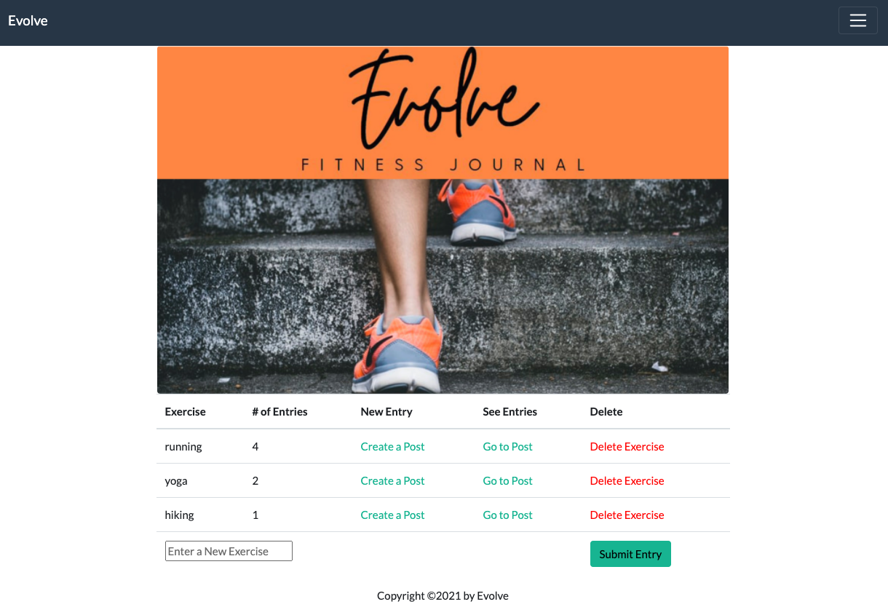
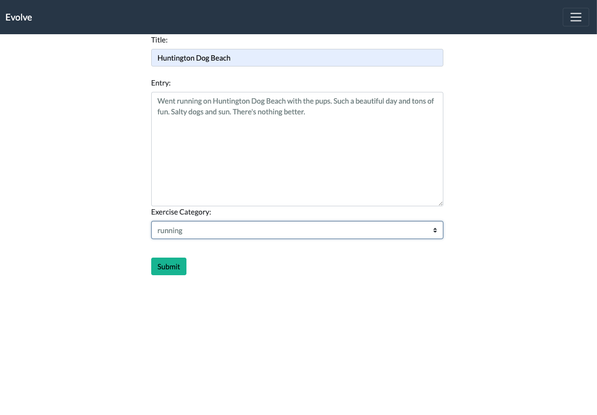
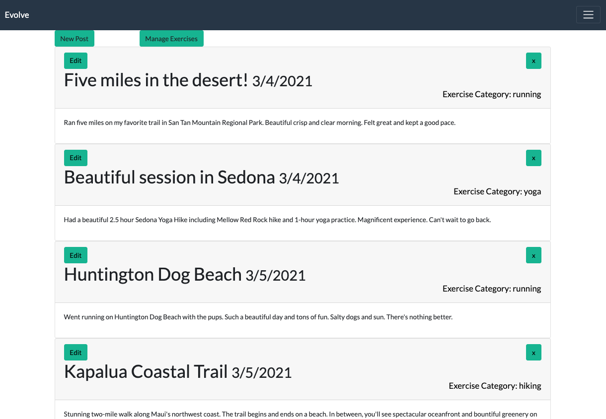

         <br> 

# Evolve
The Evolve journal app is a fitness journey of mind + body. It is a journal for tracking the user's workout progression. The user can easily track their mental journey as well as their physical journey in one app. 

The app uses a Node and Express Web Server backed by a MySQL database with a Sequelize ORM using an MVC Paradigm. With `GET, POST and DELETE` routes, the user can retrieve, add and edit journal data. 

Evolve is also a PWA (progressive web application) wherein the user can opt to install the app to their device from an icon in their browser. 

No sensitive API key information is saved on the server as the user is required to sign up for journal access. Passport, an Express-compatible authentication middleware for Node, authenticates requests for the Evolve app.

## Project Links
[Repo Link](https://github.com/onomatopoetica/evolve) <br>
**NOTE:** Since this application cannot be deployed on GitHub, the deployed app can be found on [Heroku](https://evolve-journal.herokuapp.com/). Please see the **Getting Started** section for more information regarding installation, usage, contribution guidelines, tests and where to go for questions.
    
## Table of Contents
1. [Project Team](#Evolve-Project-Team)
1. [About The Project](#About-The-Project)
1. [Project Links](#Project-Links)
1. [Demo](#Demo)
1. [Getting Started](#Getting-Started)
1. [Installation](#Installation)
1. [Usage](#Usage)
1. [Tests](#Tests)
1. [Contribution Guidelines](#Contribution-Guidelines)
1. [Questions](#Questions)
1. [Project Status](#Project-Status)
1. [License](#License)
 
## Evolve Project Team <br>

#### [Onomatopoetica](https://github.com/onomatopoetica) <br>
#### [RebeccaChiquete](https://github.com/rebeccachiquete) <br>
#### [MarleeMcinelly](https://github.com/marleemcinelly) <br>

## About The Project

* When the user logs into the app, they are taken to a `Welcome` page where they click a button to enter the Evolve journal app.

* On the main page, the user has a variety of options from which to choose to get started. They can:
    * View journal entries by exercise type
    * Create a new exercise category
    * Create a journal entry
    * Go to existing journal entries
    * Delete an exercise category
    * Go to journal page to see all entries
    * Logout

* On the journal entries page is a form to complete. The user can create a journal entry by entering:
    * An entry title
    * A summary about the workout 
    * Select the exercise category associated with the entry, e.g., yoga.
* The user can then:    
    * Submit the entry
    * Go to existing journal entries
    * Manage exercise categories

* On the journal page, the user can:
    * View all of their journal entries
    * Edit a journal entry
    * Delete a journal entry
    * Return to the journal entries page to create a new entry
    * Return to the main page to manage exercise categories    

Because this application cannot be deployed on GitHub, a walkthrough video demonstrates its functionality below. The deployed app can be found on [Heroku](https://evolve-journal.herokuapp.com/).

## Demo

#### The following is an overview of the application in operation and rendering of the Evolve app. 
    
 

#### The following are screenshots of the application and overview of its functionality: <br>

#### Below demonstrates how the PWA (Progressive Web App) works. PWA brings a native app-like user experience to cross-platform web applications. Notice the icon in the upper right area of the browser. This allows you to install `Evolve` onto your device. <br>

 <br>





## Getting Started
    
#### The following languages, libraries/packages + runtime environment used in this project include:
* MySQL 
* Node
* Express
* Sequelize ORM
* Passport 
    
#### Installation: 
```  
git clone - https://github.com/onomatopoetica/evolve.git
```
#### Usage 
``` 
See About The Project or demo video above for more information on how it works.
View Project Links above for the link to the deployed app on Heroku.
```
#### Tests
```
After cloning the repo:

Create a server.js file. Make a package.json file by running 'npm init' from the command line.
Install the dependencies: enter command 'npm i'. 
The application will be invoked by using 'nodemon' or entering 'node server.js' in the command line. 
You will see 'App now listening at localhost:8080' in the console. You can then view the app on http://localhost:8080/.
```    
#### Contribution Guidelines
```
When contributing to this repository, please contact the project team for review of your contribution plan. 
See contact details below.
```
## Questions 
#### Connect with the project team: <br>

#### [Onomatopoetica](https://github.com/onomatopoetica) <br>
#### [RebeccaChiquete](https://github.com/rebeccachiquete) <br>
#### [MarleeMcinelly](https://github.com/marleemcinelly) <br>
   
<details>
    <summary>Contact</summary>
    jendotb@gmail.com
</details>
<br>

## Project Status
<details>
    <summary>Current Project Activity</summary>
    Active
</details>
<br>
    
## License
#### Distributed under the MIT License. See `LICENSE` for more information.

##### This README was generated with :hearts:&nbsp; by [Good README Generator](https://github.com/onomatopoetica/Good-README-Generator).

